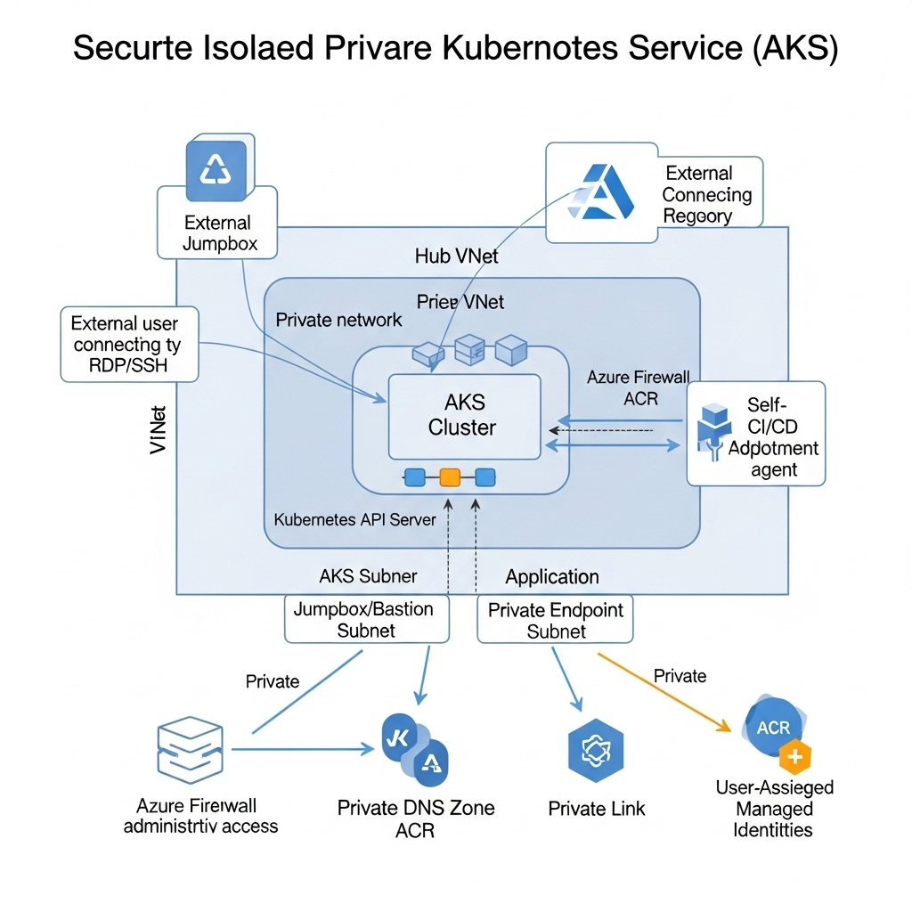

# Private_AKS

## Overview

The **Private_AKS** project automates the deployment of a secure, private Azure Kubernetes Service (AKS) cluster environment using Terraform. It emphasizes network isolation, secure key management, and private connectivity to ensure enterprise-grade security and scalability.

## Architecture

The architecture consists of two Virtual Networks (VNets) — a **Hub VNet** and an **AKS VNet** — connected via peering. Key services such as Azure Bastion, Azure Key Vault, and private endpoints reside within these VNets to restrict exposure to the internet and facilitate secure communication.

---

### Components

- **Virtual Networks and Subnets:**
  - Hub VNet: Shared services including Bastion and Key Vault private endpoints.
  - AKS VNet: Dedicated AKS workloads, Application Gateway, and utilities.
  - Subnet segmentation ensures clear separation of concerns and secure traffic flows.

- **Azure Bastion:**
  - Secure RDP/SSH access to VMs in the private network without public IP exposure.

- **Azure Key Vault:**
  - Secures secrets and keys with private endpoint integration and access policies.
  - Linked to Private DNS zones for seamless private access.

- **Private Endpoints & Private DNS Zones:**
  - Enable private access to Azure PaaS resources via private IP addresses.
  - DNS zones linked to VNets to resolve private resource addresses.

- **Virtual Machines:**
  - Example Windows VM deployed with NIC attached to the appropriate subnet.

---

### Security

- Fully private networking with no public IP exposure for AKS and critical resources.
- Use of managed identities and tenant-based policies for secure access to Key Vault.
- Bastion host for secure VM management.
- Network peering with allowed traffic types for controlled communication between VNets.

---

